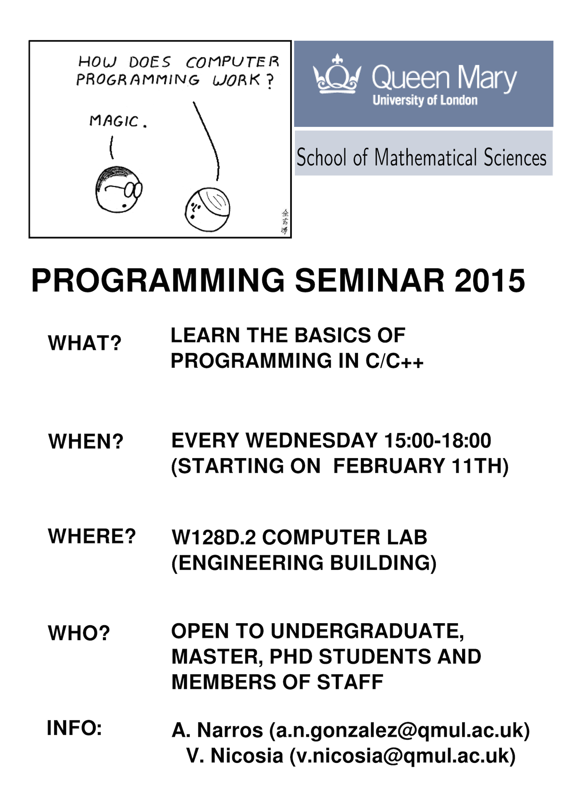

BasicCpp
===========

Basic course in C/C++
---------------------

#### Provide a practical introduction to standard and basic programming in c/c++.

## Syllabus

1. [Introduction](Lecture1.pdf):
 * Motivation: Why C/C++ and not Fortran, Matlab, etc ? Differences between C and C++
 * Basic Syntax: Tokens, semicolons, Comments, Identifiers, Keywords ...
 * C/C++ Data Types and C/C++ Variables: C/C++ Variable declaration and Variable Definition.
 * Operators: Arithmetic. Relational, logical, bitwise, assignment, misc operators, operator precedence.
 * Type casting.

2. [Decision making](Lecture2.pdf):
 * if.
 * switch.
 * nested if.
 * nested switch.

3. [Loopy programming](Lecture3.pdf):

 * While.
 * for.
 * do ... while.
 * nested loops.
 * Loop control statements: Break, continue, goto.

4. [Functions and scope rules](Lecture4.pdf):
 * Local and global variables
 * Formal parameters.
 * Variable Arguments.
 * Pointers.

