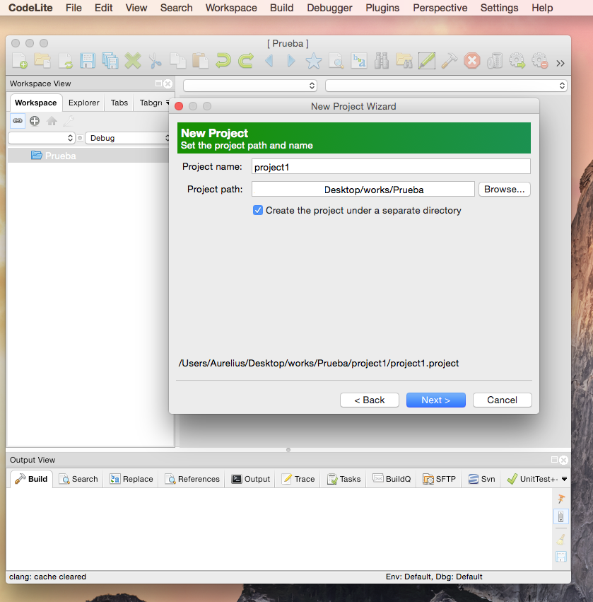
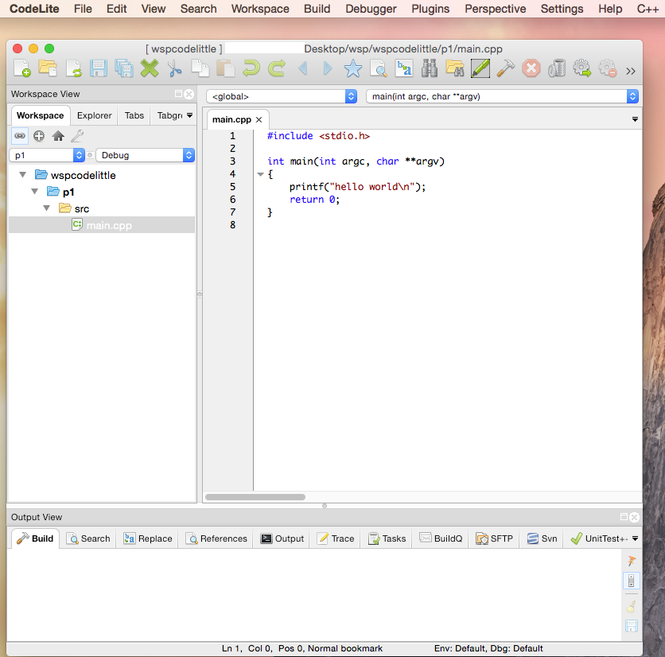

# Motivation & introduction to C/C++

## What are C and C++?

 * C was created in 1973 by Dennis Ritche, the father of C programming Language and creator of UNIX
 
  

 * C is a structured language: based on constructs, blocks & subroutines(functions).
 * C++ is a statically typed, compiled, general-purpose, case-sensitive, free-form programming language that supports procedural, object-oriented, and generic programming (!).
 * C++ development started in 1979 by Bjarne Stroustrup

 

 * C++ supports advanced object oriented programming (OOP)
 * Any compiler of C++ is able to compile most of C (not viceversa ).
 * C produces fastest codes (second only to FORTRAN). C++ is slightly slower than C.
 * C/C++ is multi-platform.
 * Both are quite popular! [link](http://langpop.com/)
 * Very important software is written in C, e.g., MySQL, Linux, ...
 * Some dialects: Visual C++, Borland C++, Turbo C++, ANSI C++.

## Why  C/C++?

  * C is fast, often as fast as the code written in assembly language.
  * C/C++ works well with the operating system.  The following software is written in C
      *  Unix and first versions of Windows.
      * Print Spoolers (they are programs that performs the printing work).
      * Network Drivers (Programs that work with the network hardware ).
      * Databases (They have you in Google DBS , Bank DBS, etc.).
      * Language interpreters (Matlab, Mathematica, Perl, Python, etc. ).
      * Text editors (early versions of MS office).
  * C++ offers the possibility of programming with different styles: C, Fortran, meta-programming, etc.
  * C++ has the Standard-Template-Library (STL): contains algorithms programmed in a very efficient and general style.
  * C/C++ is used in research and teaching: it is clean and easy to explain easy concepts.
  * C/C++ is highly portable, only need a compiler (installed in most of computers).
  * OOP permits:
    * to create and maintain large projects.
    * to define abstract data types.
    * to implement details are hidden from other modules(interface).
    * to easily modify existing code.

## The compiler

## Portability of C/C++

  * Portability of any language depends on the object code created by the compiler.
  * C/C++ compiler produce machine code which is directly executed by the CPU.
  * C/C++ code is therefore machine dependent and tied to a particular Operative System (OS).
  * We must try to recompile the program before executing program if we change OS.
  * Java and C# are much more portables since their compiler only generate intermediate code that is interpreted by the corresponding interpreter---if the right interpreter exisists for your computer... 
  * Matlab, Mathematica, perl, bash… are scripting languages, where a script is (using an interpreter) is "compiled" every time that is executed.
  * Computer guys like the  write-once-compile-anywhere (WOCA) philosophy.

## References

  * [www.cplusplus.com](www.cplusplus.com), reference website in C++.
  * [www.cprogramming.com](www.cprogramming.com), tutorials in C/C++ .
  * [Thinking in C++ (2nd ed), Bruce Eckel, Prentice Hall (2000)](http://mindview.net/Books/TICPP/ThinkingInCPP2e.html), free of charge book in pdf format.
  * [the C book](http://publications.gbdirect.co.uk/c_book/), beginner book for C, free of charge.
  * Search engines, of course!

\newpage

# Hands-on C/C++

## We are going to use [CodeLite](www.codelite.com), an integrated programming environment:

\pagebreak

***

### Create a workspace (it only has to be done once!)

\pagebreak

***

### Create a new project (Has to be done for every project)

\pagebreak

***

### Select application g++ console executable

\pagebreak

***

### Name the project in the workspace

\pagebreak

***

### Select Compiler (gcc) and debugger (dbg) 

\pagebreak

***

### then you should have something like that:

\pagebreak

***

###  Build and execute the project

If you want to see your program in action, you have to "build" it first...

\pagebreak

***

###  Build and execute the project

...mark to remember this choice

\pagebreak

***

### The result is displayed in the CodeLite console

\pagebreak

***

### Always check the message of the compiler

\pagebreak

## Practice

Copy the source code of of the file [hello_world.cpp](../codes/hello_world.cpp)  into the file main.cpp of the project created above, 
compile and execute. You should see *your* first program greeting the world! Not bad!

## Comments
 
 * can be used to add explanation to parts of the program.
 * always ignored by the compiler.
 * useful to keep part of the code that you don't want to use.
 * often highlighted with a specific colour

## Practice
 
Create a new project in the workspace and copy the source code of the file [comment.cpp](../codes/comment.cpp) into the file main.cpp.
You should have something like this:

\pagebreak

Comments would be self-explanatory. Read carefully the code and the comments, compile and execute.
The program will ask you to introduce an input. After, press the return key send the input to to program.
You try to delete or write more comments in the code.
Then compile and execute it. You should not see any differences in the console output.

## Standard input and output

The main characters are `cin` and `cout`.

***

### C++ cin/std::cin

  * Syntax: `cin >> variable ;` . Pay attention to the ";" (semicolon)---Every statement in C/C++ finishes with ";".
  * Need to include the file `iostream.h` at the beginning (Input Output Stream header).
  * It is convenient to write `using namespace std;`. This allow us to use directly `cin`, otherwise you should write `std::cin`.
  * `>>` is the extraction/get operator in C++. In C we have a similar `scanf()` function.
  * Data goes from the input device address (called `cin`) to the variable.
  * You can translate the statement `cin >> variable;` in "extract (`>>`) from the keyboard device (`cin`) the data and store it in `variable`".

***

### C++ cout/std::cout

  * Syntax: `cout << variable ;` or `cout << " " ;` . Anything between quotation marks is string. Pay attention to the ";" (semicolon).
  * Needs to include the file `iostream.h` at the beginning.
  * It is convenient to write `using namespace std;`. This allow us to use directly `cout`, otherwise you should write `std::cout`.
  * `<<` is the extraction/get operator in C++. In C we have a similar `printf()` function.
  * Data goes from the variable to the screen/console address (which is called `cout`).
  * It is possible to send any variable or string to the console with a single statement.
  * You can translate the statement `cout << variable ;` in "insert (`>>`) on my screen (cout) the data stored in `variable`".

***

### C++ endl/std::endl

  * Syntax: `<< endl ;` . Pay attention to the ";" (semicolon).
  * Needs to include the file `iostream.h` at the beginning.
  * It is convenient to write `using namespace std;`. This allow us to use directly `cout`, otherwise you should write `std::cout`.
  * You have to use the insertion operator before `<< endl;`.
  * In practive, the `endl` variable is equivalent to the `\n` (new line) character.

## Exercise

Create a new project in the workspace and copy the source code of the file [cincoutendl.cpp](../codes/cincoutendl.cpp) into the main.cpp file.
Read the program statements and the comments above them. Try to understand the procedure to program input/output on the keyboard/screen.
Finally, try to solve the proposed exercise.

*Pay attention to the variable type* `string` *!*.

You have to include a new file at the beginning: `#include <string>`

