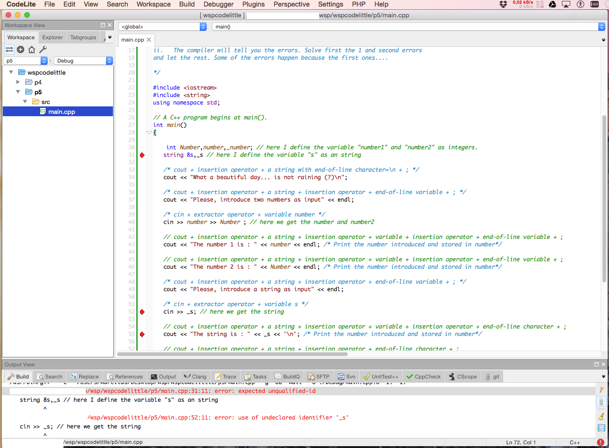

# Tokens in C++

## Outline

 1. Identifiers.
 2. Keywords.
 3. Constants.
 4. Types.
 5. Operators.
 6. Rules to name different variables in a programme.
 7. Casting.

##  Tokens


\FloatBarrier


##Identifiers

Any name element is an identifier. They are basically names given by the programmer.
It is any variable, function, data definition, etc.

###Rules:

 1. Alphabet, digits and underscore are allowed.
 2. They can not start with a digit.
 3. keywords can be used as identifiers.
 4. It is case-sensitive.
 5. Special characters are not permitted.

##Practice:

 1. If you are using an IDE, create a new project.
 2. Copy the code from the file [identifiers.cpp](../codes/identifiers.cpp).
 3. Read the program.
 4. There are several mistakes, correct them.
 5. Compile and run the program.

***



\FloatBarrier

***

Try to answer next questions:

 - Is it working?
 - Why not?
 - What do the compiler say about them?

## Keywords and special characters

List of keywords:


\FloatBarrier

***

List of special characters:


\FloatBarrier

They can not be used as identifiers (named variables, functions, etc. )

## Practice

Identify the keywords and special characters, using the previous list, in the program [identifiers.cpp](../codes/identifiers.cpp).

## Constants

 * Integer or floating point number, such as $8$ or $19.27$.
 * Single letters between single quotation marks, such as `'\n'` or `'a'`.
 * Strings between double quotation marks, such as `"Hello world\n"`.


## Fundamental types

You use them to define variables of type:

 * `void` (empty type): represent nothing(?).
 * `bool` : can be only `true` or `false`;
 * `char` : can store characters such as `'a'`, `'b'`, `'\n'`, `'\t'`, etc.
 * `int` :  can store integer numbers.
    - Modifiers (Signedness): `signed`/`unsigned`
    - Size: `short`/`long`/`long long`

***

## Properties of integers


\FloatBarrier


***

 * Briefly, floating point types represent real numbers:
   - `float`: size usually is 16 bits.
   - `double`: size usually is 32 bits.
   - `long double`: size usually is 64 bits.

***

Range of validity of each type


\FloatBarrier

##  Casting

### i.e., transformation in a different type

You can use a variable of a certain type
as it were a variable a different types.
For example:
```c
int intvar = (int) floatvar
```
where `floatvar` is a variable of type float.

In `C++` it is also possible to use the following syntax:

```c
int intvar = int(floatvar)
```


##Practice

 - Create a new project (if you are using an IDE).
 - Copy the code in the file ctetypes.cpp iside inside your new `main.cpp` file.
 - Read carefully the program statements and the comments above them.
 - Compile the code.
 - Execute the code (in an IDE these last two steps often goes together)

***

Answer these questions:

 - Is there any mistake?
 - Where?
 - What does the compiler say?

Then change the variable `s_string` with `i_number`, compile and run...

##  Assignment Operators


\FloatBarrier

## Arithmetic Operator

    A=4;
    A=2; 


\FloatBarrier

## Relational Operator

    A=4;
    A=2;


\FloatBarrier


## Logical Operators:

    A=4;
    A=2;


\FloatBarrier

## Practice:

 - Create a new project if you have an IDE. Otherwise, just create a new file.
 - Copy the source code of the file [operators.cpp](../codes/operators.cpp) on to the new `main.cpp` file.
 - Read carefully the program statements and the comments above them.
 - Compile/run the code.


***


\FloatBarrier

# Statements and decision making


## Outline

  * Define the concept of program statement.
  * Define the concept of program flow.
  * Implement a decision-making program:
    + `if` structure.
    + `if-else` structure.
    + nested  `if-else` structure.
    + `switch` statement.
    + `switch` is equivalent to nested `if-else`.


## Statements

C++ statements are individual instructions of a program:

  * They finish with a semicolon, i.e, `;`  .
  * They are executed in the same order as they appear in the source code.

We have already seen several statements, e.g.,

  * Variable declarations.

    ```c   
    int x;
    ```

  * Print on the stardard output `std::cout`.

    ```c
    cout << "x is 100";
    ```

  * Read from stardard intput `std::cin`.

    ```c   
    cin >> x ;
    ```


## Program Flow and control flow statements.

A program can be defined as the ordered execution of several computer statements.
The execution order is from the top to the bottom.
The control flow statements allows the program to prevent (Decision making) or repeat (Loop statements) the execution of some statements.
Here you can see two program flow diagrams of a very silly program:


\FloatBarrier

## Decision Making

  * `if ( condition ) statement;` 

    If the condition is false, then the statement is not executed, e.g.,

    ```c    
    if (m == 18)
    cout << "m is = 18";
    ```   

  * `if ( condition ) { statement 1; statement 2;} ` 

    When you need several statements under the same condition,  embrace them with curly brackets, i.e.,

    ```c   
    if (m == 18) {
     cout << "m is ";
     cout << m;
    }
    ```


   The statements within the curly brackets form a code *block*.
   It is strongly suggest to use the braces, even with only one statement.


  * `if ( condition ) statement1; else statement2; `
    Execute statement1 if the condition is true, otherwise  execute statement2. You can replace one of the two statements with a block, for example:

    ```c   
    if (m == 18) {
     cout << "m is 18";
     cout << "You are an adult person";
    }
    else
    cout << "m is not 18";
    ```

  * Nested `if` conditions. No need to combine several if-else constructs as it is possible to use the construct

    ```c
    if (m > 0)
     cout << "m is positive";
    else if (m < 0)
     cout << "m is negative";
    else
     cout << "m is 0";
    ```

  * `switch`. Similar to the nested if-else, sometimes is faster.
    It can be easily used when the control variable has a constant value. The syntax is

    ```c
    switch (expression) {
     case constant1:
       block1;
       break;
     case constant2:
       block2;
       break;
     default:
       default-block;
    }
    ```
   
    For example:

    ```c
    switch (x) {
      case 1:
      case 2:
      case 3:
         cout << "x is 1, 2 or 3";
         break;
      default:
         cout << "x is not 1, 2 nor 3";
    }
    ```

## Practice

  * Create a new project in the workspace.
  * Copy the source code of the file [decision_making.cpp](../codes/decision_making.cpp) to the new main.cpp file:
  * Read carefully the statements of the program before playing with it!
  * Try to figure out what is the output.
  * Don't you think that  something is missing?

***

Here there is the flow diagram that might be help you to understand this program


\FloatBarrier

***

 * Now create another project and deploy the file [decision_making2.cpp](../codes/decision_making2.cpp) 
 * What should be the code in case you want to give a second opportunity to the programme user?


***

Here there is the flow diagram that might be help you to understand this program


\FloatBarrier

***

   Let's do something more interesting.
 * Create one project more and deploy the file  (decision_making3.cpp)[../codes/decision_making3.cpp]
 * Read the code!
 * What happens if the input in line 32 is not a text but a number?
 * How will you change it in order to prevent such case?

***

Here there is the flow diagram that might be help you to understand the


\FloatBarrier


***

  * Another exercise... create a new project based on [decision_making4.cpp](../codes/decision_making5.cpp).
  * Try to figure out how this program work! 
  * Can you be even more specific? for example, in line 77 the answer can be not a number... How can you change the code in order to prevent this case?
  * Can you find or think other cases where the programme might not work?

***

The flow diagram is


\FloatBarrier


***

Last but not least...

  * create a new project based on [decision_making5.cpp](../codes/decision_making5.cpp) 
  * Read carefully the statements of the programme.
  * Try to understand what is the possible output as a function of the possible input.
  * Switch-statement can be easily transformed in a nested if-else statement. Can you please do it?

***

The flow diagram is


\FloatBarrier


