# Part II: Hands on C/C++

## The programming environment

We are going to use the 
[CodeLite a Integrated-Programming-Environment:](http://codelite.org)

### How can we use it?

- 

- 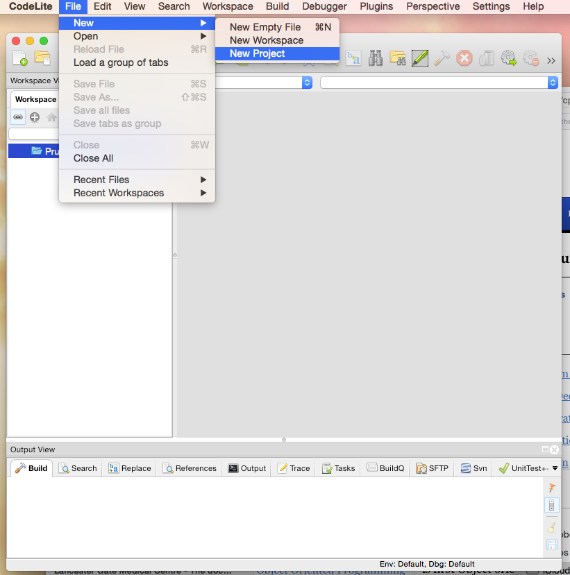
	
	-	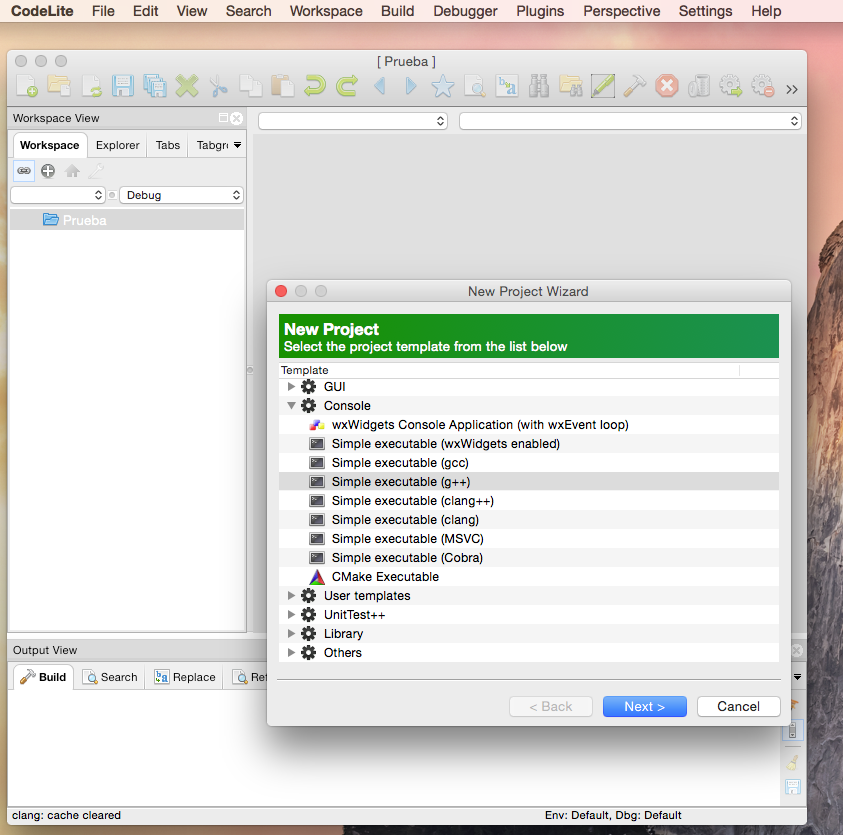	

	-	

	-   
	
	-   
	-   
- 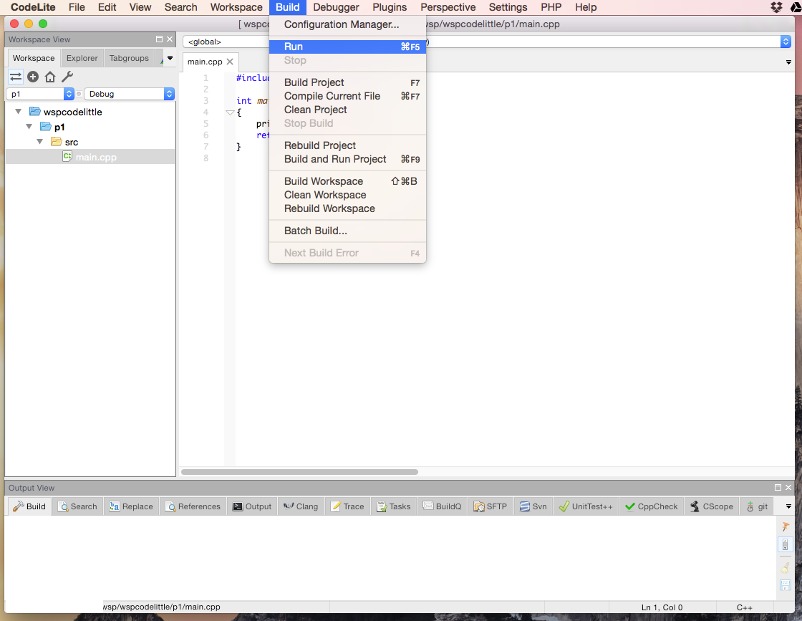
	
	- 	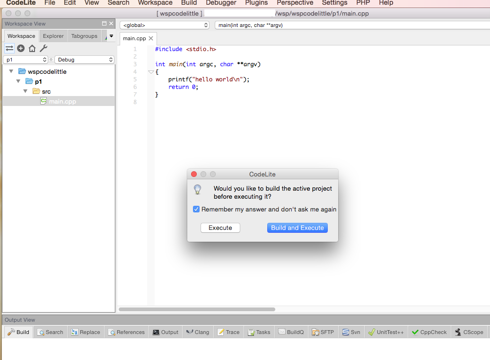

	- 	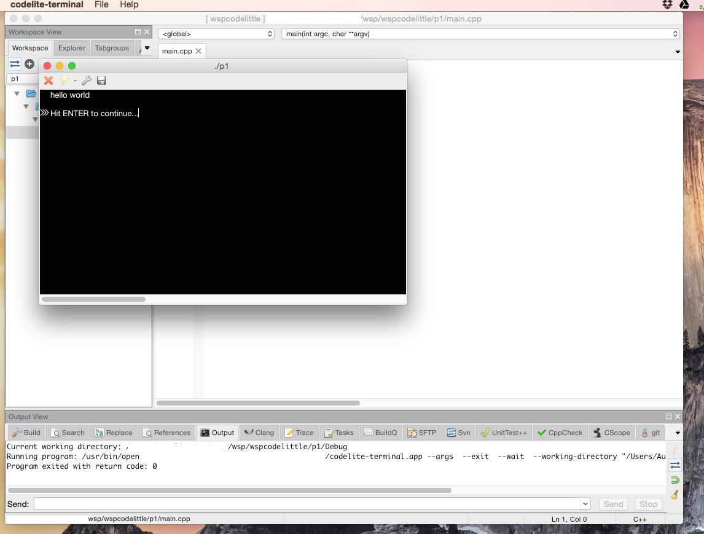

	-   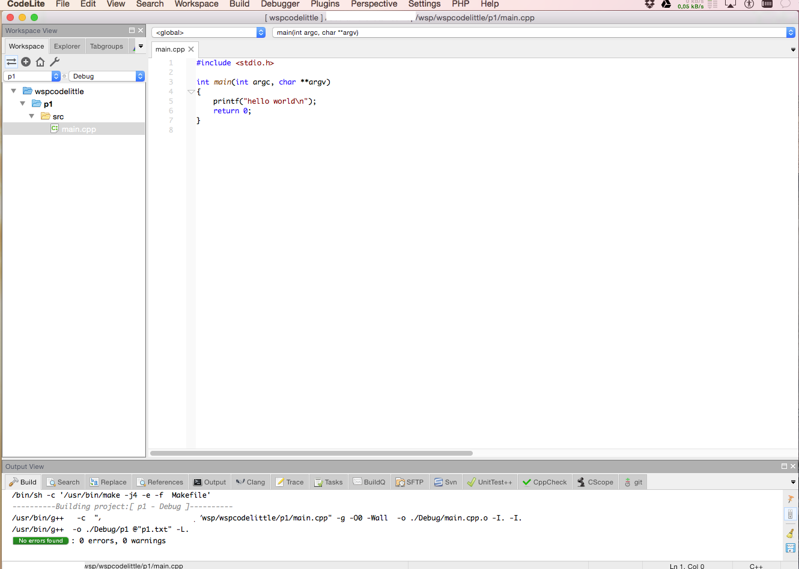

### Practice:

**EXERCISE 1** : Create a new project (p2 for example) in CodeLittle.

## Hello World (the easiest program in C++)

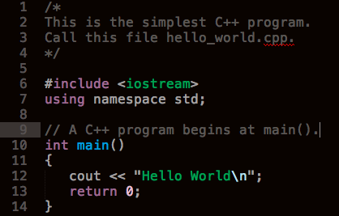

### Explanation:

#### The Header

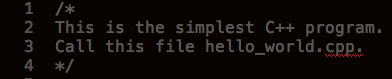

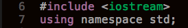

#### The *main()** function

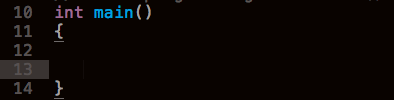

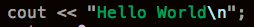

#### The *return* line or *end of program*

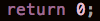

#### The output of the program

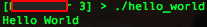

### Practice:

**EXERCISE 2** : Copy the source code of [**hello world program**](src/hello_world.cpp) in the new
project created above, compile and execute. You should display the "Hello world" again in the console. 

## Comments

### why comments?

- 	Comments are used to document your program, i.e., you know what exactly does each variable or 	  statement .
-   Comments are useful for hiding non-usable code.
-   Comments can be used to explain a particular part of the program or variable.
-   Comments are always ignored by the compiler.
-   There is not limitation about how many comments can be written.
-   Too many comments is bad style programming. 
-   Comments in IDE are coloured with a specific colour. 

### Practice:

**EXERCISE 3** : Create a new project (p3 for example) in the workspace and copy the source code of 
[comment.cpp file ](src/comment.cpp) in to the main.cpp file. You should have something like this:

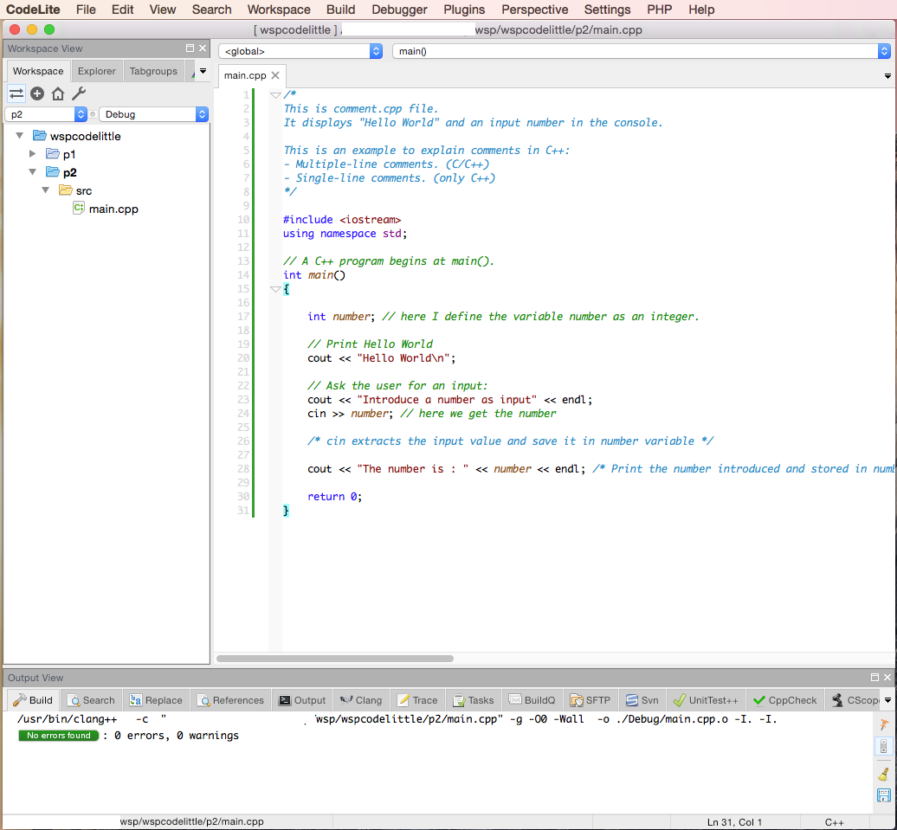

Comments are self-explanatory. Read carefully the code and comments. Compile and execute. The program will ask you to introduce any input. Press return key to get the output in the console.

**EXERCISE 4**: Delete or write more comments in the program. Then compile and execute the program.
You should not see any differences in the console output.

## C++ cin/std::cin, cout/std::cout, endl/std::endl

### C++ cin/std::cin

- 	**Syntax**: *cin >> variable ;* . Pay attention to the "**;**" (semicolon). 
    Every statement in C/C++ finishes with "**;**".
	
	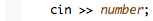

-   You should **include** the file **iostream.h** at the beginning. 

	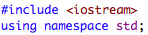

-   It is convenient to write after **using namespace std;**. Then, you can 
    use **cin**, otherwise you should write **std::cin**.
-   **>>** is the *extraction/get operator* in C++. In C we have the 
	equivalent **scanf() function**.
-   Data goes from the input device address (**variable cin**) to the variable.
-   You can load many inputs to different variables.
-   *Note*: You can understand *cin >> variable ;* such as:
	"extract (*>>*) from the keyboard device (*cin*) the data and store it in (*variable*)".

### C++ cout/std::cout

- 	**Syntax**: *cout << variable ;* or *cout << "<string>"* ; . 
	Anything between quotation marks is string. Pay attention to the "**;**" (semicolon). 
 	
	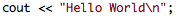

-   You should **include** the file **iostream.h** at the beginning. 

	

-   It is convenient to write after **using namespace std;**. Then, you can 
    use **cout**, otherwise you should write **std::cout**.
-   **<<** is the *insertion operator* in C++. In C we have the 
	equivalent **printf() function**.
-   Data goes from the variable to the screen/console address (**variable cout**).
-   You can send any variable or string to the console with a single statement.
-   *Note*: You can interpret *cout << variable ;* such as:
	"insert (*>>*) on my screen (*cout*) the data stored in (*variable*)".

### C++ endl/std::endl

- 	**Syntax**: *<< endl ;* . Pay attention to the "**;**" (semicolon). 
 	
	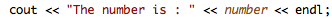

-   You should **include** the file **iostream.h** at the beginning. 

-   It is convenient to write after **using namespace std;**. Then, you can 
    use **endl**, otherwise you should write **std::endl**.
-   You have to use the insertion operator before: **<< endl;**
-   **endl variable** is equivalent to **"\\n" character**

### Practice:

**EXERCISE 5**: Create a new project (p4 for example) in the workspace and copy the source code of 
[cincoutendl.cpp file ](src/cincoutendl.cpp) in to the main.cpp file. You should have something like this:

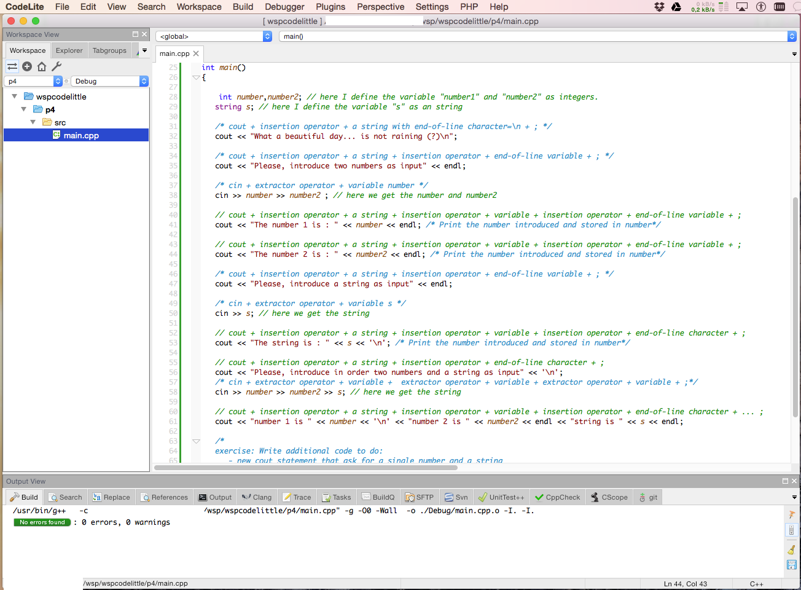

Read the program statements and the comments above them. Try to understand the procedure to program input/output on the keyboard/screen. Finally, try to solve the exercise proposed. 

Pay attention to the new variable type "string". You have to include a new file at the beginning:
**#include \<string\>**.

<ul>
  <li><a href="index.html">Home</a></li>
  <li><a href="seminar_partI.html">Part I</a></li>
  <li><a href="seminar_partIII.html">Part III</a></li>
</ul>